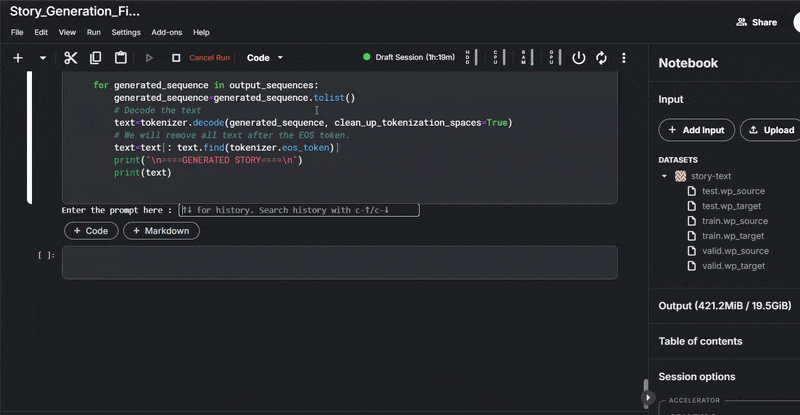

# 📚 VERSECRAFT

[](https://story-and-poetry-generate.vercel.app/)

VerseCraft is an AI-powered web application that enables users to generate original stories and poems based on a selected theme, optional user prompt, and word limit. Built with a clean user interface and backed by advanced **Seq2Seq (Sequence-to-Sequence)** models, this project merges creativity with cutting-edge natural language generation.

---

## 🚀 Live Demo

🔗 **Try it out now**: [https://story-and-poetry-generate.vercel.app](https://story-and-poetry-generate.vercel.app)

---

## ✨ Features

- 🎭 **Multiple Themes**  
  Generate content based on curated themes: *Thriller, Horror, Romantic, Humor, Adventure*.

- ✍️ **Custom Prompt Support**  
  Users can input a starting prompt or let the AI generate content independently.

- ⏳ **Word Limit Control**  
  Define the maximum length of the generated story or poem.

- 🤖 **AI Text Generation using Seq2Seq Models**  
  Utilizes deep learning sequence models to ensure contextual, fluent, and coherent content.

- 💻 **Modern, Responsive UI**  
  Built with React and Tailwind CSS for an intuitive and sleek user experience.

---

## 🛠️ Tech Stack

| Layer          | Technology                       |
|----------------|----------------------------------|
| **Frontend**   | React.js, Tailwind CSS           |
| **Backend**    | Flask / FastAPI (if applicable)  |
| **AI Model**   | Seq2Seq (Encoder-Decoder architecture) |
| **Hosting**    | Vercel                           |

---

## 🧠 How It Works

1. The user selects between generating a **Story** or a **Poem**.
2. They choose a theme and optionally provide a text prompt and word limit.
3. This data is passed to a backend service (or processed client-side via API).
4. A **Seq2Seq model** interprets the input and generates a structured, meaningful output.
5. The output is rendered instantly in the UI.

---

## 📸 Sample Outputs
Experience how the model brings creativity to life through AI-generated content.
### 🧚‍♀️ Poem Output (Romantic Theme)


### 🧟 Story Output (Adventure Theme)




---

## 📦 Getting Started (For Developers)

### Frontend Setup

```bash
git clone https://github.com/Shauryaa20/Story-And-Poetry-Generate.git
cd story-and-poetry-generator
npm install
npm run dev
